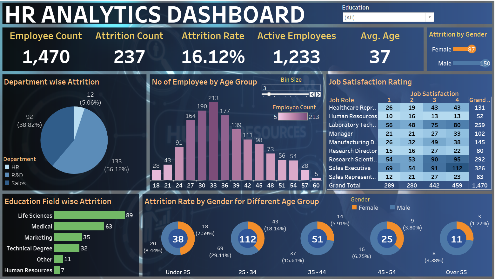

# 🧑‍💼 HR Analytics Dashboard using Tableau

This project explores employee data to uncover trends and insights that can help HR teams make data-driven decisions. The interactive dashboard was built using Tableau.

## 📌 Objective
To analyze various HR metrics like employee attrition, job satisfaction, department-wise performance, and salary distribution.

## 📁 Files
- `HR_Analytics_Dashboard.twbx`: The Tableau dashboard
- `data/hr_data.csv`: Cleaned dataset (contains anonymized employee records)
- `images/dashboard_screenshot.png`: Preview of the dashboard

## 🎯 Key Features of the Dashboard
- Attrition rate by department and age group
- Job satisfaction distribution
- Monthly hiring/exit trends
- Salary analysis by job role
- Interactive filters for department, gender, and education level

## 📊 Screenshot

## ▶️ View Live (if on Tableau Public)
👉 [View the interactive dashboard on Tableau Public](https://public.tableau.com/views/HRANALYTICSDASHBOARDBYOmKapkoti/HRAnalyticsDashboard?:language=en-US&:sid=&:redirect=auth&:display_count=n&:origin=viz_share_link)

## 🛠 Tools Used
- Tableau Public
- Microsoft Excel / Google Sheets (for initial cleaning)
- Python (pandas + matplotlib)

## 📈 Insights
- Higher attrition in Sales and Support departments
- Employees with lower job satisfaction and high overtime are more likely to leave
- Clear correlation between performance rating and salary band

## 🚀 Future Improvements
- Add predictive attrition modeling using machine learning
- Build HR KPIs over time
- Connect to a real-time HRMS (HR Management System) database

